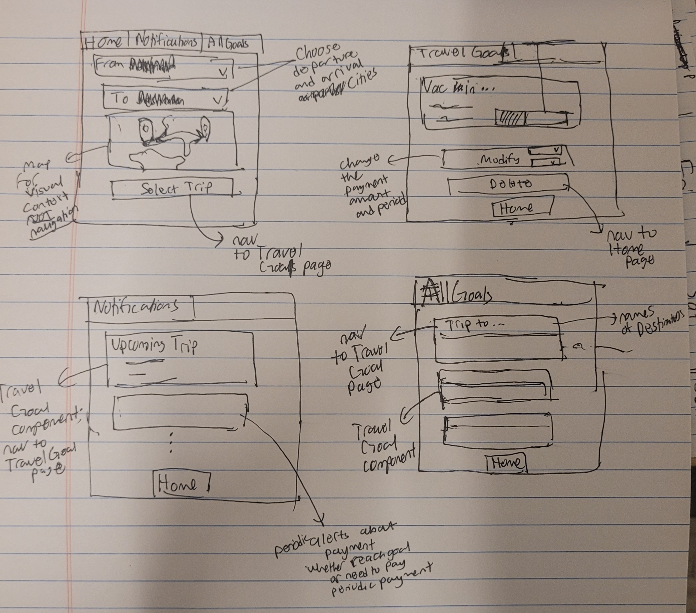

# Problem Domain: Managing Finances

### Domain:💰 **Managing Finances**
I lack precise tracking of my spending, which makes it difficult to understand where my money goes at the end of the month or year and makes it difficult to save for small or large expenses. This problem highlights a need for better visibility into my financial habits. I want to have an easier time tracking my spending and savings so I can go on trips wiht friends or buy electronics, or other consumer items that most people can't just buy on the fly.

### Problem: Tracking savings for discretionary expenses
Betweeen paying the bills and saving for large expenses, saving for discretionary expenses is often forgotten about. Either people splurge and potentially regret it later or they avoid discretionary expenses altogether. For instance, if an average person wants to go on a vacation, they devote a large part of a few paychecks to afford it, or they decide to forgo taking the trip.

| Problem | Stakeholders | How the Stakeholder is Related to the Problem |
|---|---|---|
| **Piggy Bank** | **Direct Users** | Individuals who struggle with saving for discretionary goals, especially vacation costs, are the core users. They need a simple, intuitive tool to help them overcome behavioral challenges and consistently set aside money for things they want. |
| | **Fintech Companies & Banks** | Existing financial institutions and technology companies with savings features (like Qapital) are directly impacted. They may see this solution as a threat to their user base or a potential opportunity for partnership or acquisition to enhance their own offerings. |
| | **Retailers & Travel Companies** | Businesses that sell the products or services people are saving for (e.g., travel agencies, clothing stores) have a direct interest in seeing their target customers reach their savings goals. They could use this tool to offer targeted promotions or a seamless purchasing experience. |

| Problem | Citation | Explanation |
|---|---|---|
| **2. Piggy Bank (Tracking Savings for Discretionary Expenses)** | **Saving is a Challenge:** [1](https://www.nerdwallet.com/article/finance/2025-financial-goals-midyear-check-in-report) | Nearly half of Americans who set financial goals are not on track to meet them, showing a widespread difficulty in consistently saving for their desired outcomes. |
| | **Generational Shift in Priorities:** [2](https://www.investopedia.com/millenialls-are-prioritizing-vacation-in-their-american-dream-11797045) | A large portion of a major consumer demographic (millennials) prioritizes saving for discretionary experiences like travel, making this a highly relevant problem to a large user base. |
| | **Lack of Emergency Funds:** [3](https://newsroom.bankofamerica.com/content/newsroom/press-releases/2025/07/confronted-with-higher-living-costs--72--of-young-adults-take-ac.html) | Over half of Gen Z (55%) lack enough emergency savings to cover three months of expenses, indicating that saving for discretionary goals is often secondary or impossible due to financial insecurity. |
| | **The "Soft Saving" Trend:** [4](https://site.nyit.edu/news/features/trends_in_2024_personal_finance) | A "soft saving" trend among Gen Z prioritizes immediate experiences over traditional savings, which highlights the need for a solution that makes saving for discretionary goals feel more immediate and less like a sacrifice. |
| | **Discretionary Spending is the First to Go:** [5](https://www.mckinsey.com/industries/consumer-packaged-goods/our-insights/the-state-of-the-us-consumer) | A McKinsey report shows that consumers are most likely to cut back on discretionary spending during economic uncertainty, proving that these are the most volatile and hardest savings goals to maintain. |
| | **Inability to Form Habits:** [6](https://www.consumerfinance.gov/an-essential-guide-to-building-an-emergency-fund/) | Research from the CFPB shows that a key barrier to saving is the inability to create a consistent savings habit, suggesting that a successful solution must focus on making the process automatic and simple. |
| | **The "Paycheck-to-Paycheck" Reality:** [7](https://www.cnn.com/2024/10/27/economy/wealthy-households-living-paycheck-to-paycheck) | A significant portion of the population lives paycheck-to-paycheck, leaving little to no room for saving for non-essential purchases and highlighting the need for a tool that helps them find and set aside even small amounts. |
| | **Qapital:** (Comparable) | This app's numerous features can overwhelm users, burying the core function of saving for a specific goal and making it less effective for those who want a simple solution. |
| | **General Budgeting Apps (e.g., YNAB, Monarch Money):** (Comparable) | These apps require a high level of manual upkeep and user commitment, which is a significant barrier for people who struggle with long-term planning and want a more passive, streamlined approach. |
| | **Lack of Specificity in Goal Setting:** [8](https://www.synchrony.com/blog/bank/5-reasons-why-people-miss-financial-goals) | A key reason for failure is the lack of "SMART" goals, where a goal like "saving for a vacation" is too vague and lacks the specific, measurable, and time-bound components needed for success. |
| | **Complexity of Budgeting:** [9](https://www.cnbc.com/select/why-budgets-dont-work-for-people/) | Many people find it difficult to stick to a budget because their spending changes frequently, making the process of tracking expenses tedious and discouraging. |
| | **Behavioral Finance Challenges:** [10](https://www.allgenfinancial.com/reasons-people-cant-retire/) | Behavioral finance principles like "procrastination" and the lack of a "written plan" are major reasons people fail to save, which points to the need for a solution.|

### Application pitch
Piggy Bank is a fun and easy-to-use app designed to help people save for vacations without the stress of paying a large lump sum. Many individuals dream of traveling but struggle to set aside enough money, often leading to delayed plans or abandoned trips. Piggy Bank solves this problem by turning big vacation expenses into manageable, bite-sized savings goals, making the process motivating and achievable.

The app offers three key features. First, the **Destinations Catalog** allows users to explore a curated library of travel destinations complete with realistic estimates for flights, lodging, and activities. This feature removes the guesswork from planning and gives users a clear idea of the funds they need to save. Second, **Automated Savings & Progress Tracking** helps users set personalized goals, suggests contributions, and monitors progress. By breaking down large expenses into smaller steps, it encourages steady savings and reduces procrastination. Finally, the **Notification system** will remind users every set period to save some amount they allocated for the vacation goal. 

Piggy Bank benefits multiple stakeholders. Direct users gain a simple, motivating tool to achieve their travel dreams. Fintech companies and banks may view Piggy Bank as a competitor or a potential partner, presenting opportunities for collaboration or acquisition. Retailers and travel companies benefit when users successfully save and make purchases, creating opportunities for targeted promotions and increasing conversions.
By combining intuitive planning, automated saving, and rewarding engagement, Piggy Bank transforms the stress of vacation budgeting into an enjoyable, goal-oriented experience.

### Concept Design
---
### concept PasswordAuthentication [User]
* **purpose** limit access to verified users
* **principle** a user must register and confirm their email before they can authenticate and use the app
* **state**
    * a set of **Users** with
        * `username` **String**
        * `password` **String**
* **actions**
    * `register (username: String, password: String): (user: User)`
        * **requires** `username` not in **Users**
        * **effect** adds username and password and associates it with User user
    * `authenticate (username: String, password: String): (user: User)`
        * **requires** username exists
        * **effect** returns the user if `password` matches the one associated with username, otherwise Error
---
### concept ProgressTracking [TripCostEstimation, User]
* **purpose** create and track savings plans for discretionary vacation goals
* **principle** a plan breaks a trip’s cost into manageable contributions, the user sets a payment period and the amount to be paid every period. The user can also change those details for some trip.
* **state**
    * a set of **Users** with
        * a set of **Plans**  
    * a set of **Plans** with
        * a `trip` **TripCostEstimation**
        * a `paymentPeriod` **Number**
        * a `amountPerPeriod` **Number**
        * a `goalAmount` **Number**
        * a `currentAmount` **Number**
* **actions**
    * `createPlan (user: User, trip: TripCostEstimation, paymentPeriod: Number, amountPerPeriod: Number, goalAmount: Number): (plan: Plan)`
        * **requires** amountPerPeriod is the amount that the user selects to pay every paymentPeriod month
        * **effect** makes a new plan linked to `trip` and `user`
    * `addAmount (user: User, plan: Plan, amount: Number)`
        * **requires** plan exists and belongs to user
        * **effect** increases `currentAmount` of plan by amount
    * `removeAmount (user: User, plan: Plan, amount: Number)`
       * **requires** plan exists and belongs to user and amount less than or equal to currentAmount associated with plan
       * **effect** decreses `currentAmount` by amount
    * `deletePlan (user: User, plan: Plan)`
        * **requires** `plan` exists and belongs to user
        * **effect** removes plan
    * `modifyPlan (user: User, plan: Plan, newPaymentPeriod: Number, newAmountPerPeriod: Number)`
        * **requires** plan exists and belongs to user    
        * **effect** updates savings schedule associated with plan by changing the paymentPeriod to newPaymentPeriod and
        * amountPerPeriod to newAmountPerPeriod

---
### concept TripCostEstimation [User]
* **purpose** generate realistic cost estimates based on trip details
* **principle** based on a user's choice of initial dpearture city and arrival city, and the user's sheltering accomodations and food location preferences, an estimate is provided
* that reflects the aforementioned
* **state**
    * a set of Users with
      * a set of **TravelPlans**
    * a set of Accomdations with
      * a set of livingSpaces **String**
    * a set of Locations with
       * a String city
    * a set of **TravelPlans** with
        * a `fromCity` **Location**
        * a `toCity` **Location**
        * a `fromDate` **Date**
        * a `toDate` **Date**
        * a `necessity' **Necessity**
    * a set of **Necessities** with
        * an `accommodation` **String**
        * a `diningFlag` **Boolean**
* **actions**
    *  createTravelPlan(user: User, fromCity: Location, toCity: Location, fromDate: Date, toDate: Date): (travelPlan: TravelPlan)
         * **requires** fromCity and toCity exists and toDate > fromDate and both are greater than the current date
         * **effect** create and return a travelPlan with a fromCity, toCity, and from and to dates, and a default necessity (accomodation = "hotel", diningFlag = 1 to indicate eating out; 0 means homecooked meals)
    * deleteTravelPlan(user: User, travelPlan: TravelPlan)
         * **requires** travelPlan exists and belongs to user
         * **effect** delete the travelPlan
    *  updateNecessity(user: User, travelPlan: TravelPlan, accomodation: String, diningFlag: Boolean): (travelPlan: TravelPlan, necessity: Necessity)
         * **requires** travelPlan exists and belongs to user, accomodation exists as one of the livingSpaces and diningFlag indicates whether the user eats out most of the time (1) or eats homecooked meals (0)
         * **effect** create and add the necessity with accomodation and diningFlag to travelPlan
    * resetNecessity(user: User, travelPlan: TravelPlan)
         * **requires** travelPlan exists and belongs to user
         * **effect** reset the necessity belonging to travelPlan to the default as described in the action createTravelPlan
    * `estimateCost (user: User, travelPlan: TravelPlan): (totalCost: Number)`
         * **requires** travelPlan exists and belongs to user
         * **effect** based on the departure, arrival dates, necessities and departure and arrival locations, gives an estimated cost of the plan, totalCost

---
### concept Notification [User, ProgressTracking]
* **purpose** remind users to save and celebrate milestones
* **principle** for each user's savings plan, a message is sent to the user to remind them of the amount they planned to save
* **state**
    * a set of **Notifications** with
        * `user` **User**
        * `progress` **ProgressTracking**
        * `frequency` **Number**
        * `message` **String**
* **actions**
    * createNotification(user: User, progress: ProgressTracking, frequency: Number, message: String): (notification: Notification)
         * **effect** create and return a notification with the above input details
    * deleteNotification(user: User, notification: Notification)
         * **requires** notification exists and belongs to user
         * **effect** deletes the notification

---
### Synchronizations

* **sync register**
    * **when** `Request.register(username, password)`
    * **then** `PasswordAuthentication.regiseter(username, password): (user)
* **sync authenticate**
    * **when** `Request.login(username, password)
    * **then** `PasswordAuthentication.authenticate(username, password): (user)`
* **sync createPlan**
    * **when**
    *       `Request.createTravelPlan(user, fromCity, toCity, fromDate, toDate)`
    *       `TripCostEstimation.createTravelPlan(...): (trip)`
    * **then**
    *       `TripCostEstimation.estimateCost(user, trip): (cost)`    
* **sync estimateCost**
    * **when**
    *       `Request.createPlan(user, trip, paymentPeriod, amountPerPeriod)`
    *       `TripCostEstimation.estimateCost (user, trip): (cost)`
    * **then**
    *    `ProgressTracking.createPlan(user, trip, paymentPeriod, amountPerPeriod, cost): plan`
    *    `Notification.createNotification(progress: plan, frequency: Number, message: String)`
* **sync deleteTravelPlan**
    * **when** `Request.deleteTravelPlan(user, plan)`
    * **then**
    *          `TripCostEstimation.deleteTravelPlan(user, travelPlan: plan)`
    *          `ProgressTracking.deletePlan(user, plan)`
---
### Brief Note
The concepts partition the app into four clear roles. **PasswordAuthentication** secures access and ensures that all actions of all concepts, except PasswordAuth itself, are tied to verified users. **TripCostEstimation** helps to give an estimate of a vacation's cost based on the user's lodging, food, and location choices. **ProgressTracking** converts estimates into actionable savings plans and tracks contributions over time. Finally, **Notification** supports behavioral reinforcement by reminding users to save and celebrating progress milestones. **Synchronizations** connect these concepts: authentication gates access to all others; trip selection triggers estimation; estimation feeds into plan creation; progress events trigger reminders and milestone celebrations. Together, these concepts make Piggy Bank both secure and motivating.

### UI Sketches

### User Journey
Sarah is a 26-year-old recent graduate who dreams of taking a trip to Tokyo with her friends. But every month, she finds herself overspending on small things and never setting aside enough money. The thought of saving feels overwhelming, and she worries she’ll never make her dream vacation happen.

One evening, after realizing yet again that she has little left over for savings, Sarah downloads the Piggy Bank app. On the home page (see sketch 1) she’s greeted by a simple map interface where she can set her “From” and “To” destinations. She selects Boston → Tokyo and instantly feels like her vague dream is becoming a concrete goal.

Next, Sarah navigates to the Travel Goals overview (sketch 2). She sees a list of potential trips she’s set up, each with a progress meter showing how much she has saved so far. For Tokyo, she’s only just begun—0% progress. The clean layout and visual feedback help her see exactly where she stands without any confusion.

Curious to make a plan, she taps her Tokyo goal and moves into the Goal Detail page (sketch 3). Here, she adjusts the sliders to commit to saving $250 per month for the next 12 months. The app recalculates and shows her projected progress bar filling up over time. For the first time, she can picture a clear path from “wishful thinking” to actually boarding that flight.

Over the next few weeks, Sarah begins setting aside the recommended amount. On the Notifications page (sketch 4), she gets friendly reminders each month—“You’re 25% of the way to Tokyo!”—and celebratory nudges when she hits new milestones. Instead of guilt, she feels momentum.

By the end of the year, Sarah has hit her savings target. She opens the app one last time, sees her Tokyo goal at 100%, and books her flight. What once felt cumbersome has become easier, thanks to Piggy Bank helping her visualize, plan, and stick with her savings journey.
